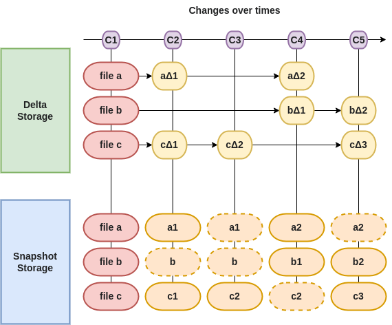
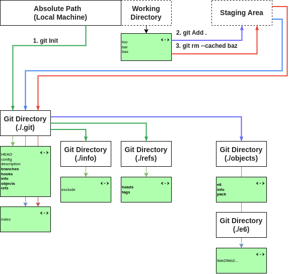

# Git e GitHub

## Che cosa sono i VCS?

Un *`VCS`* (Version Control System) è un sistema software che gestisce le modifiche apportate ai file di un progetto e mantiene traccia delle versioni precedenti.

Le proprietà che un VCS deve avere sono:

* Tracciamento delle modifiche al codice nel tempo
* Gestione di versioni multiple del codice
* Facilità di collaborazione tra team di sviluppo
* Possibilità di tornare a versioni precedenti del codice
* Monitoraggio delle modifiche effettuate da diversi collaboratori

## Che cos'è Git?

Git è un sistema di controllo versione (VCS) open source basato su istantanee (snapshot) dei file, che ha le seguenti **funzionalità aggiuntive**:

* Creazione di branch per lo sviluppo in parallelo
* Gestione di merge tra branch
* Risoluzione dei conflitti
* Utilizzo di tag per marcare versioni importanti (milestone)
* Supporto per repository remoti per facilitare la collaborazione

## Che cos'è GitHub?

GitHub è una piattaforma web che offre hosting per progetti basati su Git. Oltre a ciò fornisce anche una vasta gamma di strumenti per la collaborazione, la documentazione e la gestione delle attività.

Le proprietà di GitHub sono:

* Hosting di repository Git
* Strumenti di collaborazione come issue tracker, pull request e code review
* Funzionalità di documentazione come wiki e README
* Integrazione con altri strumenti di sviluppo [CI/CD](https://www.redhat.com/it/topics/devops/what-is-ci-cd)
* Interfaccia utente intuitiva e collaborazione con altri utenti e team
* Possibilità di scegliere tra versioni pubbliche e private del repository
* Supporto per la gestione dei branch e dei merge.

## Perchè usare Git e GitHub?

Git e GitHub sono utilizzati insieme per gestire il ciclo di vita del codice software. Git permette di tracciare le modifiche apportate al codice e di collaborare con altri sviluppatori, mentre GitHub fornisce un'infrastruttura per l'hosting del codice e offre una serie di strumenti per la collaborazione, la documentazione e la gestione delle attività.

Gli sviluppatori usano Git e GitHub per:

* Tracciare le modifiche al codice nel tempo
* Collaborare con altri sviluppatori su un progetto
* Risolvere conflitti di codice e gestire il merging di codice
* Documentare il codice e le attività di sviluppo
* Automatizzare il processo di sviluppo con integrazioni CI/CD
* Condividere il codice con il pubblico o con un team chiuso.

In sintesi, Git e GitHub sono usati per rendere più efficiente e collaborativo il processo di sviluppo software.

---

## Approfondimenti

### VCS basati sui delta e sugli snapshoot

I sistemi di controllo versione (VCS) possono essere basati sui *`delta`* o sugli *`snapshot`*, a seconda del modo in cui gestiscono le modifiche ai file all'interno del repository.

* Un sistema di controllo versione basato sui *`delta`* memorizza solo le modifiche apportate al file rispetto alla versione precedente, ovvero il delta tra le versioni successive di un file. Ad esempio, se un file viene modificato, il sistema memorizza solo le modifiche effettuate rispetto alla versione precedente. Questo significa che ogni versione di un file viene memorizzata come un insieme di modifiche effettuate rispetto alla versione precedente.
* Un sistema di controllo versione basato sugli *`snapshot`* memorizza l'intero stato del repository in un determinato momento. Ogni volta che viene effettuato una commit, il sistema di controllo versione crea uno snapshot del repository, ovvero uno stato completo di tutti i file nel repository. In questo modo, ogni versione di un file viene memorizzata come uno snapshot completo del file al momento del commit.

La principale differenza tra un sistema di controllo versione basato sui delta e uno basato sugli snapshot è il modo in cui gestiscono le modifiche ai file. Un sistema di controllo versione basato sui delta può essere più efficiente in termini di spazio di archiviazione, poiché memorizza solo le modifiche effettuate ai file. Tuttavia, la ricostruzione di una versione precedente di un file può richiedere la combinazione di più delta, il che può rendere più complessa la gestione delle versioni.

D'altra parte, un sistema di controllo versione basato sugli snapshot è più semplice da gestire, poiché ogni versione di un file viene memorizzata come uno snapshot completo del file al momento del commit. Tuttavia, questo può richiedere più spazio di archiviazione per mantenere tutti gli snapshot.

### Le sezioni

Un progetto Git è composto da tre sezioni principali: la *`Git Directory`*, la *`Working Directory`* e l'*`Staging Area`*.

* *`Git Directory`* contiene tutti i metadati e le informazioni necessarie a Git per tenere traccia delle modifiche apportate al progetto. In particolare, questa sezione contiene un database di oggetti che comprende versioni compresse dei file del progetto.

* *`Working Directory`* è la cartella in cui l'utente lavora localmente sul progetto. Questa sezione recupera i file del progetto dal database degli oggetti nella directory Git e li posiziona sulla macchina locale dell'utente. Quando l'utente apporta modifiche ai file, questi vengono salvati nella directory di lavoro.

* *`Staging Area`* è una sezione intermedia in cui l'utente può selezionare i file modificati che desidera includere nella prossima versione del progetto. In pratica, l'utente seleziona i file modificati dalla directory di lavoro e li sposta nell'area di staging. Quando l'utente è soddisfatto delle modifiche effettuate, può eseguire un commit, ovvero una conferma definitiva delle modifiche.

### Gli stati e le azioni

In Git, ogni file nella cartella di lavoro può trovarsi in uno dei tre possibili stati: *`staged`*, *`modified`* o *`committed`*.
La gestione di questi stati consente di tenere traccia delle modifiche apportate al progetto in modo preciso e accurato.

* Lo stato *`staged`* si verifica quando un file viene modificato e la nuova versione viene contrassegnata per essere aggiunta al repository locale. Questo avviene utilizzando il comando *`git add`*.
* Lo stato *`modified`* si verifica quando un file è stato modificato ma non è ancora stato contrassegnato per essere aggiunto al repository. In altre parole, le modifiche al file non sono ancora state registrate.
* Lo stato *`committed`* si verifica quando le modifiche a un file sono state aggiunte al repository locale. Questo avviene utilizzando il comando *`git commit`*, che salva le modifiche in modo permanente nel repository.

Inoltre, Git offre tre azioni per gestire questi stati e sincronizzare il repository locale con il repository remoto.

* Il comando *`git push`* viene utilizzato per aggiungere tutti i file commessi presenti nel repository locale al repository remoto, rendendoli visibili a chiunque abbia accesso al repository remoto.
* Il comando *`git fetch`* viene utilizzato per ottenere i file dal repository remoto e aggiornare il repository locale, ma senza aggiornare la cartella di lavoro.
* Il comando *`git merge`* viene utilizzato per unire le modifiche presenti nel repository locale con la cartella di lavoro.
* Il comando *`git pull`*, combina l'effetto di *`git fetch`* e *`git merge`*, ottenendo i file dal repository remoto e aggiornando la cartella di lavoro con le modifiche presenti nel repository locale.

---

### GUIDE PER L'INSTALLAZIONE E CONFIGURAZIONE

[Git](./GUIDE/GIT.MD)

[GitHub](./GUIDE/GITHUB.MD)

---

### ESERCITAZIONI

[ESERCITAZIONE 01 - Creazione Repository Locale](./ESERCITAZIONI/ESERCITAZIONE-01.MD)

[ESERCITAZIONE 02 - Creazione di un Repository Remoto](./ESERCITAZIONI/ESERCITAZIONE-02.MD)

[ESERCITAZIONE 03 - Clonazione di un Repository Remoto](./ESERCITAZIONI/ESERCITAZIONE-03.MD)

[ESERCITAZIONE 04 - Modifica di un Repository Remoto](./ESERCITAZIONI/ESERCITAZIONE-04.MD)
